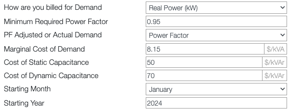
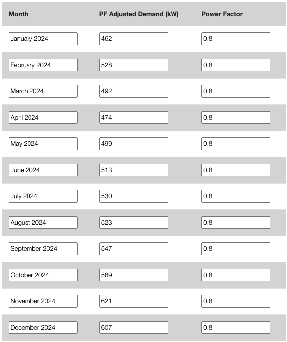
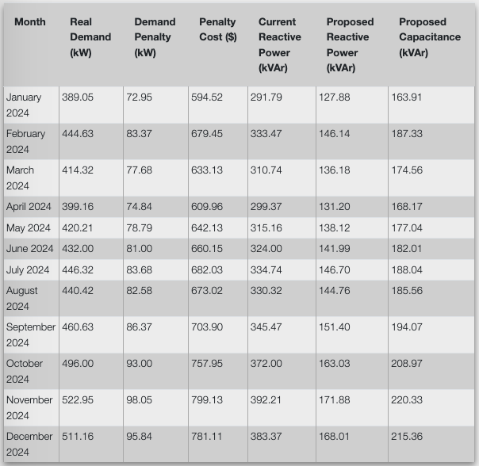

---
hide:
  - toc
---

# Power Factor Correction

Low power factor increases utility costs through reactive power demand penalties and higher apparent power (kVA) billing. Installing capacitor banks (static or dynamic) improves power factor by providing reactive power locally, reducing penalties and lowering utility bills in facilities subject to power factor-based billing structures. 

**ARC Code(s):** 2.3212

## Savings Calculation

Power factor correction savings depend on the utility's billing structure. Two common scenarios require different analysis approaches:

1. **Power Factor Penalty Structure**: Utility charges a penalty when power factor falls below a threshold (typically 0.85 or 0.90)
2. **kVA Billing Structure**: Utility bills based on apparent power (kVA) rather than real power (kW)

### Billing Structure Analysis

Before calculating savings, identify the billing structure from utility rate schedules:

**Power Factor Penalty Structure:**
- Look for clauses stating "Power factor less than [0.85/0.90] will result in penalty charges"
- May appear as additional demand charges when PF < threshold
- Target correction: threshold PF + 0.02 (e.g., if threshold is 0.90, correct to 0.92)

**kVA Billing Structure:**
- Utility bills demand based on kVA instead of kW
- May state "Demand charge: $X per kVA" in rate schedule
- Target correction: 0.95 power factor

!!! warning "Regional Billing Variations"

    Whether a utility bills based on real power (kW) or apparent power (kVA) varies by region and utility provider. Carefully review the facility's rate schedule to determine the billing structure. Some utilities use different structures for different seasons or customer classes.

### Using MEASUR for Calculations

Use the MEASUR software to calculate power factor correction savings:

1. Access the calculator: **Equipment Calcs → Power Factor Correction**

2. Enter billing information from the utility rate schedule (see screenshots below)

3. Select billing method based on facility's rate structure:
   - **Power Factor Penalty Case**: Select "Power Factor" for billing type
   - **kVA Billing Case**: Select "Real Power (kW)" for billing type

4. Select demand calculation method:
   - **Power Factor Penalty Case**: Use "PF Adjusted" for demand type
   - **kVA Billing Case**: Use "Actual Demand" for demand type

### Input Requirements

Gather the following information from utility bills:

**Basic Billing Information:**

- Billing method (Real Power kW or kVA)

- Minimum required power factor (if penalty structure)

- Target power factor for correction

- Marginal cost of demand ($/kW or $/kVA)

- Cost of static capacitance ($/kVAr) - obtain from vendor quote (50 if unknown)

- Cost of dynamic capacitance ($/kVAr) - obtain from vendor quote (70 if unknown)

- Starting month and year for analysis

**Monthly Demand Data:**

For each month of the analysis period, enter the necessary information. 

### Savings Results

MEASUR calculates monthly savings by comparing baseline demand costs to corrected demand costs. 

MEASUR provides:
- Monthly penalty costs or demand cost reductions
- Current reactive power requirements (kVAr)
- Proposed reactive power from capacitor bank (kVAr)
- Proposed capacitance costs (static vs. dynamic options)
- Annual cost savings
- Simple payback period

!!! warning "Capacitor Type Selection"

    Static capacitors provide fixed reactive power compensation and are suitable for facilities with relatively constant loads. Dynamic (switched) capacitors automatically adjust reactive power compensation based on load conditions and are better suited for facilities with varying loads. Dynamic capacitors cost more but may provide better performance and avoid over-correction during light load periods. Consult with vendors to determine the appropriate type for the facility's load profile.

## Anticipated Costs

Obtain equipment costs from vendor quotes for the specific capacitor bank configuration recommended by MEASUR analysis when possible.

## Report Requirements

In addition to the [typical report requirements](../how-to.md) and the recommendation-specific savings and costs, the recommendation should document:

- Utility billing structure (power factor penalty or kVA billing)
- Current average power factor across billing periods
- Target power factor for correction
- Required capacitor bank size (kVAr)
- MEASUR output table

!!! note "MEASUR Output Integration"

    The MEASUR power factor calculator generates detailed monthly savings tables that can be exported for inclusion in the assessment report. Use the MEASUR output to populate the monthly data table and verify calculated savings. DO NOT INSERT A SCREENSHOT. 
